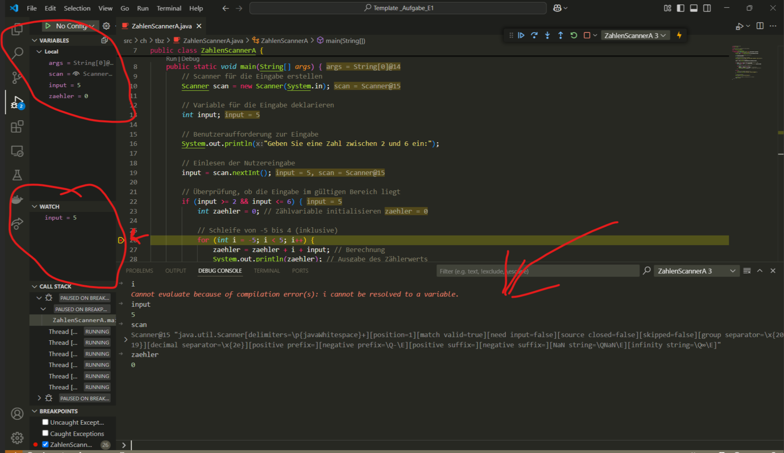

# Modul 319
## Nachweisportfolio
### Tag 1 (21.02.2025)

Wir haben hier heute nichts zu schreiben.

### Tag 2 (28.02.2025)

Wir haben hier heute nichts zu schreiben.

### Tag 3 (07.03.2025)

Wir haben hier heute nichts zu schreiben.

### Tag 4 (14.03.2025)

Heute habe ich die I1-Aufgabe gemacht, zusammen mit Donart. Wir haben gemeinsam am Text gearbeitet und uns gut abgestimmt, um alle wichtigen Punkte zu berücksichtigen. Es war eine produktive Zusammenarbeit und wir konnten die Aufgabe effizient erledigen.

[Aufgabe: I1](./Template/)

### Tag 5 (21.03.2025)

Wir haben hier heute nichts zu schreiben.

### Tag 6 (28.03.2025)

Als erstes Beschäftigten wir uns mit dem Auftrag "Welche Zahl erscheint als erstes auf der Konsole?" und wir kamen auf den entschluss das es die Zahl immer 5 ist. Danach schauten wir den rest des auftrages an bei dem es sich um Breackpoint handelt ud wir experimentierten. Nach der Vorschleife wird der Output von verschiedenen zahlen ausgewertet. Es gibt drei verschiedene möglichkeiten um die Ausgabe der verschiedenen Variabeln zu sehen.

[Aufgabe: E1](./Template%20_Aufgabe_E1.zip)

### Tag 7 (04.04.2025)
